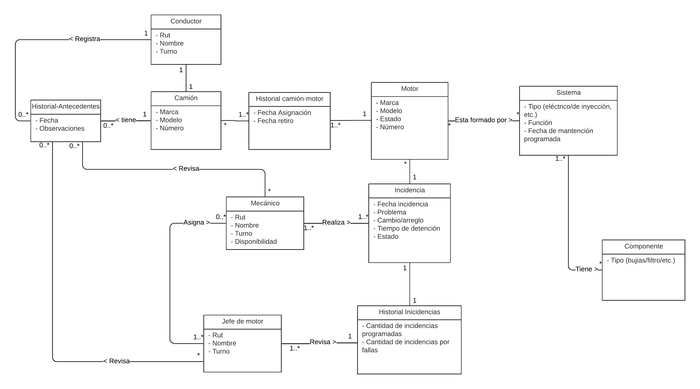

# Grupo 04 - Ingeniería de Software - 2024-2

Continuaremos trabajando los mismos integrantes del grupo 2 en el mismo proyecto de Análisis y Diseño de Software. Este es el repositorio del *Grupo 4*, cuyos integrantes son:

* Rock Dabre        - 202173077-k
* Diego Mella       - 202110018-0
* Lorna Mella       - 202110037-7
* Germán Fernández  - 202273051-k

* **Tutora**: Paula Castillo

* **Profesor**: Wladmir Ormazabal


## Wiki

Puede acceder a la Wiki mediante el siguiente [enlace](https://gitlab.com/inf236-2024-1/grupo002/-/wikis/home#wiki-grupo-02)

# Continuación - Ingeniería de Software 2024-2

- [Levantamiento del Proyecto](#levantamiento-del-proyecto)
  - [Instalación](#instalacion)
  - [Clonar repositorio](#clonar-repositorio)
  - [Configuración y Ejecución de Docker](#configuración-y-ejecución-de-docker)
  - [Acceso al Framework de Django](#acceso-al-framework-de-django)
  - [Acceso a las vistas](#acceso-a-las-vistas)
- [Consideraciones](#consideraciones)
- [Avances de Código](#avances-de-código)
  - [Avance Backend](#avance-backend)
    - [Avances Hito 2.1](#avances-hito-21)
    - [Endpoints](#endpoints)
  - [Avance Frontend](#avance-frontend)
    - [Avances hito 2.2](#avances-hito-22)
    - [Avances hito 3](#avances-hito-3)


## Levantamiento del Proyecto

### Instalación

* Instalar [Docker](https://docs.docker.com/engine/install/).
* Instalar [Docker Compose](https://docs.docker.com/compose/install/)

### Clonar repositorio

* Clonar este repositorio:

```
git clone https://gitlab.com/inf236-2024-1/grupo002.git
```

### Configuración y Ejecución de Docker

* Desde la carpeta 'inf23620241' en donde se encuentran los archivos de Docker, se debe ingresar el siguiente código:

```
docker-compose build
docker-compose up
```
De esta forma, el proyecto contendrá los docker de la Base de Datos, la API y el Frontend como se indicó en las bases del proyecto. 

### Acceso al Framework de Django

Para acceder al framework de Django (Django REST framework) se debe ingresar al puerto localhost:8000.

### Acceso a las vistas

Para acceder las vistas del frontend se debe ingresar al puerto localhost:8001.


## Consideraciones

Se debe tener en consideración que sufrimos la actualización de Docker Desktop por lo que se modificarón los archivos 'requirements.txt' y 'docker-compose.yaml' para adaptarse a dicha actualización. En el archivo docker-compose.yaml se quitaron las lineas con la versión y command: --default-authentication-plugin=mysql_native_password, siendo este último ya no utilizado en la versión actual. Por otro lado, en el archivo requirements.txt se agregó la linea cryptography. 


## Avances de Código

### Avance Backend

En esta sección se registrarán los avances de código del Backend por cada hito.

#### Avances Hito 2.1

* En este segundo hito se entregará un avance de código relacionado principalmente con la historias de usuario HU008. Para ello, nos concentraremos en la confección de la base de datos con los siguientes aspectos.

{ width=500px }


Las clases agregadas en el diagrama son:

* Historial-Antecedentes: Representa los antecedentes que se observaron por cada falla que ha tenido un camión.
* Conductor: Esta asociado al camión y es quien registra los antecedentes.


De esta forma, se modifican principalmente los archivos de la API-Base tales como: 

* models.py: Acá se definen las clases "HistorialAntecedentes" con sus respectivos atributos.
* views.py: Acá se definen las vistas para cada modelo creado.
* serializers.py: Acá se definen los serializadores para cada modelo creado.
* urls.py: Acá se registran las vistas de conjunto (viewsets) asociadas con los diferentes modelos creados.


### Endpoints

Una vez hayan levantado los contenedores pueden utilizar [Postman](https://www.postman.com) u otra herramienta similar para probar los endpoints.
En el proyecto se han implementado los siguientes:

```
GET: localhost:8000/motor/
POST: localhost:8000/motor/
PUT: localhost:8000/motor/{id_motor}/
DELETE: localhost:8000/motor/{id_motor}/

GET: localhost:8000/mecanico/
POST: localhost:8000/mecanico/
PUT: localhost:8000/mecanico/{id_mecanico}/
DELETE: localhost:8000/mecanico/{id_mecanico}/

GET: localhost:8000/incidencia/
POST: localhost:8000/incidencia/
PUT: localhost:8000/incidencia/{id_incidencia}/
DELETE: localhost:8000/mecanico/{id_incidencia}/

GET: localhost:8000/progreso/
POST: localhost:8000/progreso/
PUT: localhost:8000/progreso/{id_progreso}/
DELETE: localhost:8000/progreso/{id_progreso}/

GET: localhost:8000/MecanicosAsignados/
POST: localhost:8000/MecanicsoAsignados/
PUT: localhost:8000/MecanicosAsignados/{id_asignacion}/
DELETE: localhost:8000/MecanicosAsignados/{id_asignacion}/

GET: localhost:8000/Camion/
POST: localhost:8000/Camion/
PUT: localhost:8000/Camion/{id_camion}/
DELETE: localhost:8000/Camion/{id_camion}/

GET: localhost:8000/HistorialMotorCamion/
POST: localhost:8000/HistorialMotorCamion/
PUT: localhost:8000/HistorialMotorCamion/{id_historialMotorCamion}/
DELETE: localhost:8000/HistorialMotorCamion/{id_HistorialMotorCamion}/

#Nuevos 

GET: localhost:8000/HistorialAntecedentes/
POST: localhost:8000/HistorialAntecedentes/
PUT: localhost:8000/HistorialAntecedentes/{id_historialAntecedente}/
DELETE: localhost:8000/HistorialAntecedentes/{id_HistorialAntecedente}/

```


### Avance Frontend

En esta sección se registrarán los avances de código del Frontend por cada hito.

  #### Avances Hito 2.2

En este hito se entregará un avance de código acorde a los nuevos requerimentos del negocio incorporando las vistas relacionadas con la historia de usuario H008 principalmente. Algunos de los códigos creados y modificados son:

  * urls.py: Acá se configura las URL, definiendo las rutas a diferentes vistas. La ruta 'ingreso_antecedente/' lleva a la vista "ingreso_antecedente".

  * views.py: Se incluye la vista para generar el registro de antecedente de un camión por el conductor y se modifica la página principal para que el condutor pueda identificarse como tal. Las vistas utilizan el módulo requests para realizar peticiones HTTP a la API base y renderizan las respuestas en las plantillas HTML correspondientes. Se incluye el decorador @csrf_exempt en las vistas de creación de cuentas e incidencias para permitir peticiones POST sin validar el token CSRF.

  * Por último, se crean los archivos HTML con las configuraciones de las vistas acordes al prototipo.

  #### Avances Hito 3

En este hito se entregará un avance de código acorde a los nuevos requerimentos del negocio incorporando las vistas relacionadas con la historia de usuario H009 principalmente. Algunos de los códigos creados y modificados son:

  * urls.py: Acá se configura las URL, definiendo las rutas a diferentes vistas. Se agrega la ruta 'antecedentes/'.

  * views.py: Se incluye la vista para mostrar los antecedentes de un camión asociados a un motor y se modifica la vista crear_incidencia para que el mecanico pueda ver dichos antecedentes. Las vistas utilizan el módulo requests para realizar peticiones HTTP a la API base y renderizan las respuestas en las plantillas HTML correspondientes. Se incluye el decorador @csrf_exempt en las vistas de creación de cuentas e incidencias para permitir peticiones POST sin validar el token CSRF.

  * Por último, se crean los archivos HTML con las configuraciones de las vistas acordes al prototipo.


