# Grupo 04 - Ingeniería de Software - 2024-2

Continuaremos trabajando los mismos integrantes del grupo 2 en el mismo proyecto de Análisis y Diseño de Software. Este es el repositorio del *Grupo 4*, cuyos integrantes son:

* Rock Dabre        - 202173077-k
* Diego Mella       - 202110018-0
* Lorna Mella       - 202110037-7
* Germán Fernández  - 202273051-k

* **Tutora**: Paula Castillo

* **Profesor**: Wladmir Ormazabal


## Wiki

Puede acceder a la Wiki mediante el siguiente [enlace](https://gitlab.com/inf236-2024-1/grupo002/-/wikis/home#wiki-grupo-02)

# Continuación - Ingeniería de Software 2024-2

- [Levantamiento del Proyecto](#levantamiento-del-proyecto)
  - [Instalación](#instalacion)
  - [Clonar repositorio](#clonar-repositorio)
  - [Configuración y Ejecución de Docker](#configuración-y-ejecución-de-docker)
  - [Acceso al Framework de Django](#acceso-al-framework-de-django)
  - [Acceso a las vistas](#acceso-a-las-vistas)
- [Consideraciones](#consideraciones)
- [Avances de Código](#avances-de-código)
  - [Avance Backend](#avance-backend)
    - [Avances Hito 2](#avances-hito-2)
    - [Avances Hito 3](#avances-hito-3)
    - [Avances Hito 5](#avances-hito-5)
    - [Endpoints](#endpoints)
  - [Avance Frontend](#avance-frontend)
    - [Avances hito 4](#avances-hito-4)
    - [Avances Hito 5](#avances-hito-5)
- [Videos](#videos)


## Levantamiento del Proyecto

### Instalación

* Instalar [Docker](https://docs.docker.com/engine/install/).
* Instalar [Docker Compose](https://docs.docker.com/compose/install/)

### Clonar repositorio

* Clonar este repositorio:

```
git clone https://gitlab.com/inf236-2024-1/grupo002.git
```

### Configuración y Ejecución de Docker

* Desde la carpeta 'inf23620241' en donde se encuentran los archivos de Docker, se debe ingresar el siguiente código:

```
docker-compose build
docker-compose up
```
De esta forma, el proyecto contendrá los docker de la Base de Datos, la API y el Frontend como se indicó en las bases del proyecto. 

### Acceso al Framework de Django

Para acceder al framework de Django (Django REST framework) se debe ingresar al puerto localhost:8000.

### Acceso a las vistas

Para acceder las vistas del frontend se debe ingresar al puerto localhost:8001.


## Consideraciones

Se debe tener en consideración que sufrimos la actualización de Docker Desktop por lo que se modificarón los archivos 'requirements.txt' y 'docker-compose.yaml' para adaptarse a dicha actualización. En el archivo docker-compose.yaml se quitaron las lineas con la versión y command: --default-authentication-plugin=mysql_native_password, siendo este último ya no utilizado en la versión actual. Por otro lado, en el archivo requirements.txt se agregó la linea cryptography. 

# Grupo 2 - Análisis y Diseño de Software - 2024-1

Este es el repositorio del *Grupo 2*, cuyos integrantes son:

* Rock Dabre        - 202173077-k
* Diego Mella       - 202110018-0
* Lorna Mella       - 202110037-7
* Germán Fernández  - 202273051-k

* **Tutor**: Ariane Carvajal

* **Profesor**: Wladimir Ormazabal

# Proyecto - Análisis y Diseño de Software 2024-1


## Avances de Código

### Avance Backend

En esta sección se registrarán los avances de código del Backend por cada hito.

#### Avances Hito 2

* En este segundo hito se entregará un avance de código relacionado con las historias de usuarios H1, H2. Para ello, nos concentraremos en la confección de la base de datos con los siguientes aspectos.

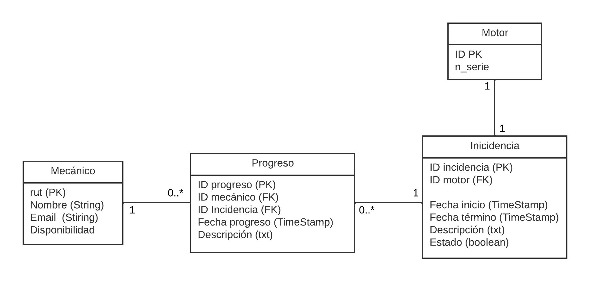{ width=500px }

Las clases principales del diagrama son:

* Motor: Representa los detalles de un motor registrado.
* Incidencia: Representa un problema o falla en un motor.
* Mecánico: Representa a un técnico calificado para reparar motores.
* Progreso: Representa el registro de cada incidencia realizadas por los mecánicos.


De esta forma, se modifican principalmente los archivos de la API-Base tales como: 

* models.py: Acá se definen las clases "Motor", "Mecanico", "Incidencia" y "Progreso" con sus respectivos atributos.
* views.py: Acá se definen las vistas para cada modelo creado.
* serializers.py: Acá se definen los serializadores para cada modelo creado.
* urls.py: Acá se registran las vistas de conjunto (viewsets) asociadas con los diferentes modelos creados.

#### Avances Hito 3

* En este tercer hito se entregará un avance de código, similar al anterior, relacionado con las mismas historias de usuarios. Para ello, nos concentraremos en la confección de la base de datos con los siguientes aspectos.

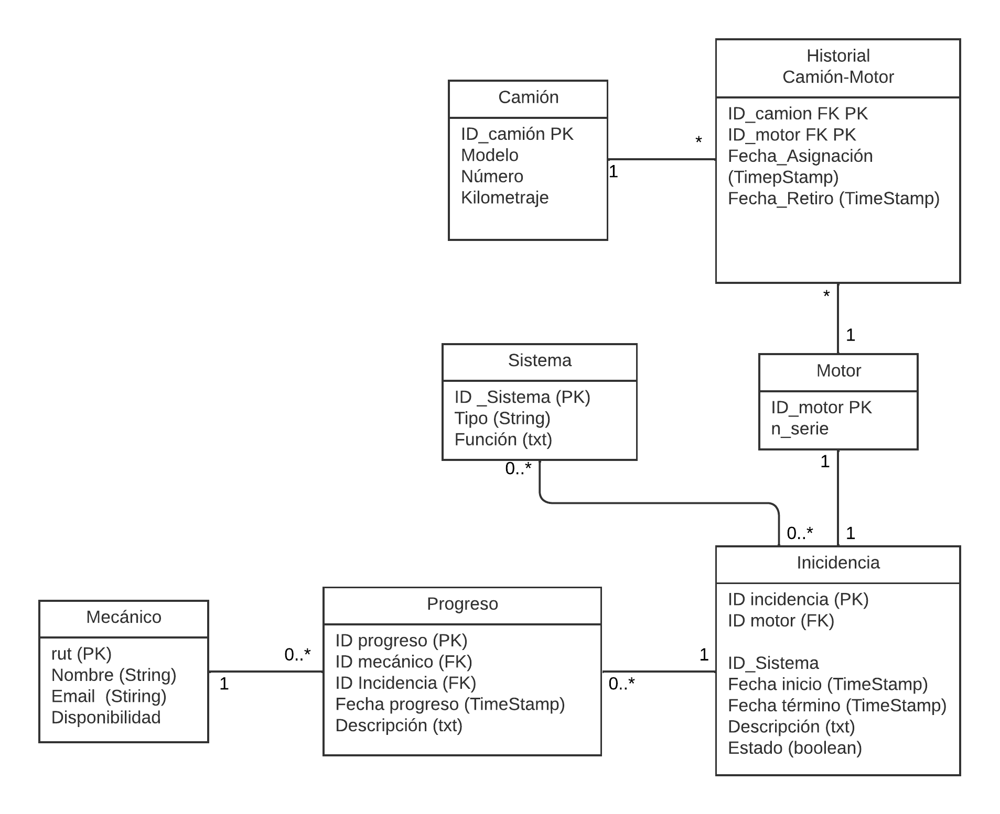{ width=500px }

Las clases agregadas en el diagrama son:

* Sistema: Representa los detalles de un sistema resgistrado.
* Historial Camión-Motor: Representa el registro de cada incidencia realizadas por los mecánicos.
* Camión: Representa a un técnico calificado para reparar motores.


De esta forma, se modifican principalmente los archivos de la API-Base tales como: 

* models.py: Acá se definen las clases "HistorialMotorCamion", "Camion" y "Sistema" con sus respectivos atributos.
* views.py: Acá se definen las vistas para cada modelo creado.
* serializers.py: Acá se definen los serializadores para cada modelo creado.
* urls.py: Acá se registran las vistas de conjunto (viewsets) asociadas con los diferentes modelos creados.

#### Avances Hito 5

En este quinto y último hito se entregará un pequeño avance código en el backend, relacionado con las asignación de mecánicos a las incidencias. Para ello, nos concentraremos en la confección de la base de datos con los siguientes aspectos.

La clase agregada es:

* MecanicosAsignados: Acá se hace un registro de la asignación de mecánicos en base al rut y al id de la incidencia.

De esta forma, se modifican principalmente los archivos de la API-Base tales como: 

* models.py: Acá se definen la clase "MecanicosAsignados".
* views.py: Acá se define la vista para el modelo creado.
* serializers.py: Acá se define el serializador para el modelo creado.
* urls.py: Acá se registra la vista de conjunto (viewsets) asociadas con al modelo creado.

También, cabe destacar que se hicieron cambios menores de atributos en las clases Incidencia, Motor y Mecánico (modificaciones en el archivo models.py).

Finalemente se entrega la versión final de la base de datos.


### Endpoints

Una vez hayan levantado los contenedores pueden utilizar [Postman](https://www.postman.com) u otra herramienta similar para probar los endpoints.
En el proyecto se han implementado los siguientes:

```
GET: localhost:8000/motor/
POST: localhost:8000/motor/
PUT: localhost:8000/motor/{id_motor}/
DELETE: localhost:8000/motor/{id_motor}/

GET: localhost:8000/mecanico/
POST: localhost:8000/mecanico/
PUT: localhost:8000/mecanico/{id_mecanico}/
DELETE: localhost:8000/mecanico/{id_mecanico}/

GET: localhost:8000/incidencia/
POST: localhost:8000/incidencia/
PUT: localhost:8000/incidencia/{id_incidencia}/
DELETE: localhost:8000/mecanico/{id_incidencia}/

GET: localhost:8000/progreso/
POST: localhost:8000/progreso/
PUT: localhost:8000/progreso/{id_progreso}/
DELETE: localhost:8000/progreso/{id_progreso}/

GET: localhost:8000/MecanicosAsignados/
POST: localhost:8000/MecanicsoAsignados/
PUT: localhost:8000/MecanicosAsignados/{id_asignacion}/
DELETE: localhost:8000/MecanicosAsignados/{id_asignacion}/

GET: localhost:8000/Camion/
POST: localhost:8000/Camion/
PUT: localhost:8000/Camion/{id_camion}/
DELETE: localhost:8000/Camion/{id_camion}/

GET: localhost:8000/HistorialMotorCamion/
POST: localhost:8000/HistorialMotorCamion/
PUT: localhost:8000/HistorialMotorCamion/{id_historialMotorCamion}/
DELETE: localhost:8000/HistorialMotorCamion/{id_HistorialMotorCamion}/


```


### Avance Frontend

En esta sección se registrarán los avances de código del Frontend por cada hito.

  #### Avances Hito 4

En este cuarto hito se entregará un avance de código relacionado al prototipo de las vistas relacionado con la historia de usuario H2 principalmente. Para ello, creamos la carpeta 'Frontend' en donde se encuentran los archivos necesarios para generar las visualizaciones de las vistas. Algunos de los códigos creados y modificados son:

  * urls.py: Acá se configura las URL, definiendo las rutas a diferentes vistas. La primera ruta vacía lleva a la vista "index", la ruta 'mecanico/' lleva a la vista "mecanico" y la ruta 'incidencia/int:id/' lleva a la vista "incidencia" con un parámetro numérico ID.

  * views.py: Acá se crea un conjunto de vistas para renderizar las diferentes páginas web, incluyendo la página principal, la página del mecánico, una incidencia específica y para crear una nueva incidencia. Se utiliza requests para realizar peticiones HTTP a la API base y se renderiza las respuestas en las plantillas HTML correspondientes. También incluye en la vista donde se crea una incidencia el decorador @csrf_exempt para permitir peticiones POST sin validar el token CSRF.

  * Por último, se crean los archivos HTML con las configuraciones de las vistas acordes al prototipo.

Cabe destacar que las vistas aún requieren de modificaciones y aún no se encuentran todas las funcionalidades que se requieren. En este caso se logra visualizar las incidencias y crearlas, pero aún no se logra modificar las incidencias y registrar los progreso.

  ##### Cómo probar avances hito 4

Después de realizar el levantamiento del proyecto, necesitamos acceder a través del navegador a http://localhost:8000/ para poder generar un motor mediante el frontend de la API REST de Django. En el hito 4 no trabajamos las funcionalidades asociadas al jefe de motores, quien es el encargado de ingresar los motores al sistema. (Para el hito 5 se desarrollará la implementación de estas funcionalidades). A continuación, mostraremos cómo crear un motor en la base de datos a través del frontend de la API REST de Django:

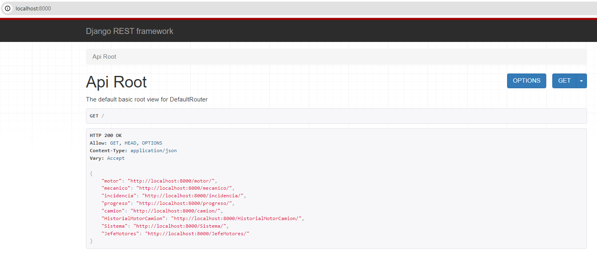{ width=500px }

- Al ingresar a http://localhost:8000/ después de haber levantado el proyecto, veremos esta vista correspondiente al frontend de la API REST de Django. Desde aquí debemos acceder a la URL: http://localhost:8000/motor/, donde observaremos la siguiente vista:

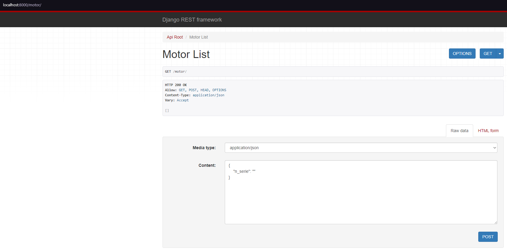{ width=500px }

- En esta vista podremos acceder a endpoints asociados a los motores. En la parte inferior, notaremos que existen casillas para ingresar datos en las cuales realizaremos un POST, es decir, crear un motor nuevo ingresando un número de serie (puede ser cualquier número) y haciendo clic en el botón "POST".

- Una vez creado un motor, notaremos que se almacena correctamente como se indica arriba, y podemos obtenerlo mediante el método GET. Luego, utilizando el ID del motor, crearemos una incidencia a través de las vistas del frontend del mecánico.

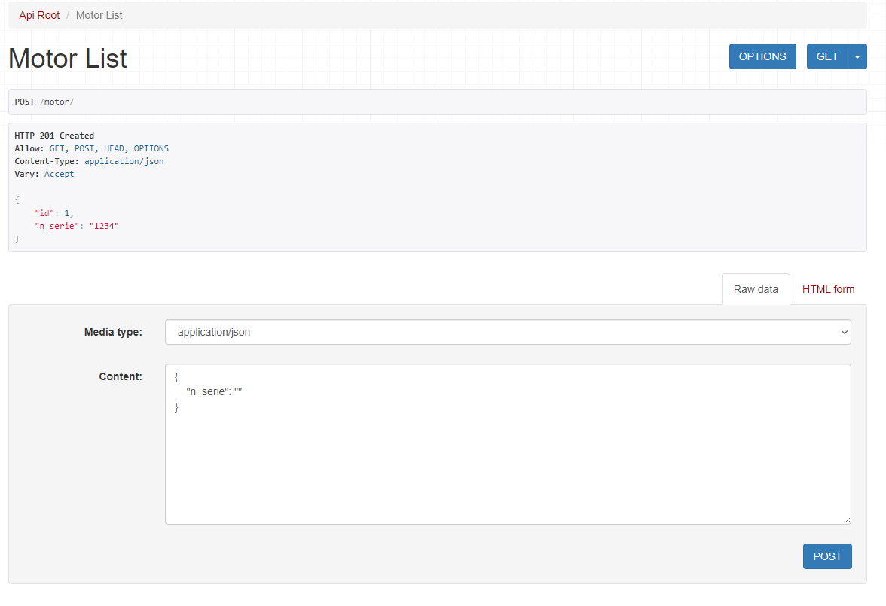{ width=500px }

- Para acceder al frontend del mecánico, debemos ingresar a http://localhost:8001/. Aquí recibiremos una vista para ingresar tanto como jefe de motores (aún no desarrollado) como mecánico. Nos enfocaremos en las funcionalidades del mecánico en este hito, especialmente en la capacidad de ingresar una incidencia a la base de datos.

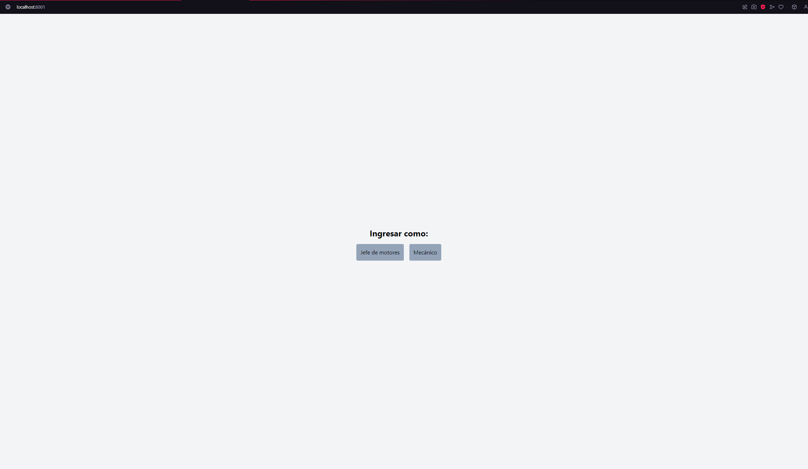{ width=500px }

- Una vez que hacemos clic en el botón de "Mecánico", debemos crear una cuenta con datos inventados como se muestra a continuación:

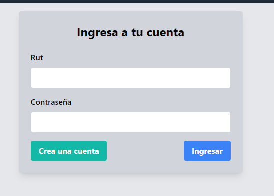{ width=500px }

- Creamos una cuenta haciendo clic en el botón verde, lo cual nos llevará a la siguiente vista donde debemos ingresar datos inventados para cualquier mecánico:

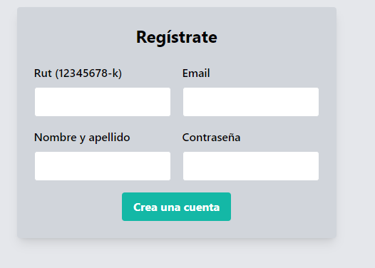{ width=500px }

- Una vez creada la cuenta, podemos iniciar sesión con la cuenta recién creada. Una vez dentro, accedemos a la siguiente vista:

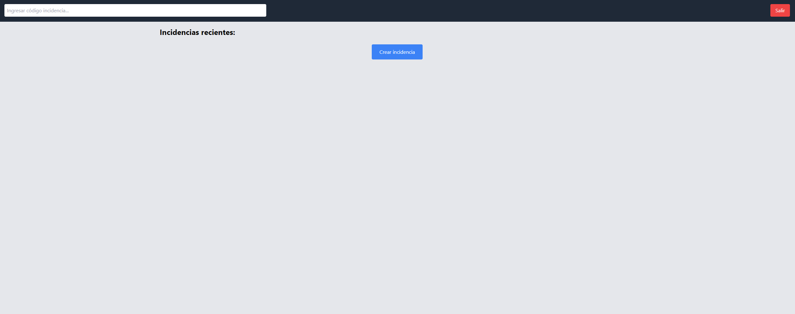{ width=500px }

- En esta tocamos crear incidencia e ingresaremos a la siguiente vista:

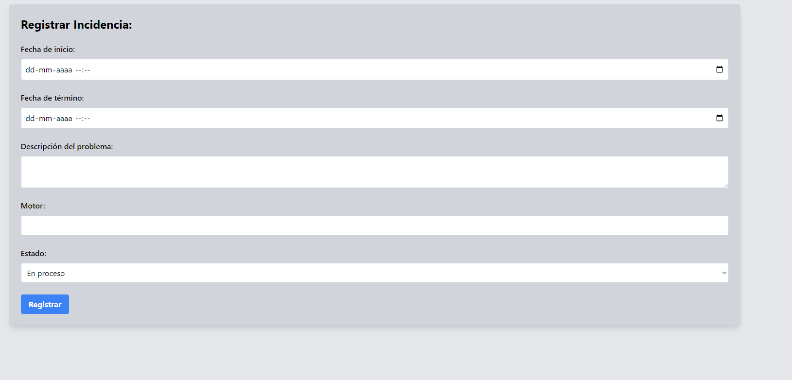{ width=500px }

- Aquí ingresamos cualquier dato, asegurándonos de ingresar "1" en el campo de motor, y luego hacemos clic en "Registrar".

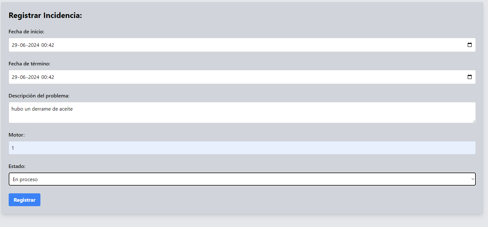{ width=500px }

- Una vez registrada la incidencia, notaremos que se guarda correctamente. Podemos ver todas las incidencias con el tiempo en http://localhost:8001/mecanico/.

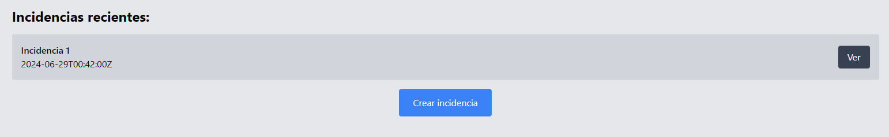{ width=500px }

#### Avances Hito 5

  Cabe recalcar que ya se trabajó en la sección del jefe de motores por lo que ya no es necesario seguir las instrucciones sobre "Cómo probar avances hito 4" para probar el software.

En este quinto y secto hito se entregará el código completo que abarca todas las historias de usuario que quedaron pendientes desde la útlima entrega y las que fueron añadidas en esta oportunidad. En la carpeta 'Frontend' se encuentran los archivos necesarios para generar las visualizaciones de las vistas. Algunos de los códigos creados y modificados son:

  * urls.py: En este archivo se definen las rutas URL para las diferentes vistas de la aplicación. Se incluyen rutas para la página principal, la gestión de cuentas y el inicio de sesión tanto para mecánicos como para el Jefe de Motores. También se gestionan las rutas para manejar incidencias, permitiendo visualizar, crear, asignar, actualizar y eliminar incidencias específicas, así como registrar el progreso de las mismas. Además, se incluyen rutas para la gestión de motores y camiones, permitiendo su visualización, creación, edición y asignación de motores a camiones. Las rutas se definen utilizando el módulo path de Django, y se asocian a las vistas correspondientes en el archivo views.py

  * views.py: En este archivo se implementan varias vistas para renderizar las páginas web y manejar las operaciones de la aplicación. Se incluyen vistas para la página principal, el inicio de sesión y la creación de cuentas tanto para mecánicos como para el Jefe de Motores. También se gestionan las incidencias, permitiendo visualizar, crear, asignar, actualizar y eliminar incidencias específicas, así como registrar el progreso de las mismas. Además, se manejan las vistas para la gestión de motores y camiones, permitiendo su visualización, creación, edición y asignación de motores a camiones. La vista del perfil del mecánico permite ver y actualizar su disponibilidad. Las vistas utilizan el módulo requests para realizar peticiones HTTP a la API base y renderizan las respuestas en las plantillas HTML correspondientes. Se incluye el decorador @csrf_exempt en las vistas de creación de cuentas e incidencias para permitir peticiones POST sin validar el token CSRF.

  * Por último, se crean los archivos HTML con las configuraciones de las vistas acordes a las funcionalidades requeridas.

Con este código es que se lleva cabo las funcionalidades propuestas por el cliente.

## Videos

  * [Video Prototipo H4](https://www.youtube.com/watch?v=pKbM7fe9oXE)
  * [Video presentación final del proyecto H6](https://www.youtube.com/watch?v=OqVrIWYF_DY)


